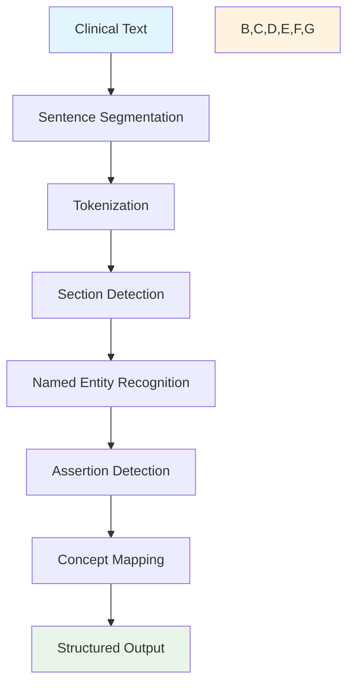

# Pipeline Overview

pyCTAKES uses a pipeline-based architecture where clinical text flows through a series of annotators, each adding specific types of annotations.

## Pipeline Architecture



## Pipeline Types

pyCTAKES provides three pre-configured pipeline types to suit different needs:

### Default Pipeline

The complete clinical NLP pipeline with all features enabled:

```python
import pyctakes

pipeline = pyctakes.create_default_pipeline()
```

**Components:**
- Clinical Sentence Segmentation (spaCy/Stanza backend)
- Clinical Tokenization with POS/lemma
- Section Detection
- Clinical NER (model + rule-based)
- Negation/Assertion Detection
- UMLS Concept Mapping

**Best for:** Production use, research, comprehensive analysis

### Fast Pipeline

Speed-optimized pipeline using rule-based components:

```python
pipeline = pyctakes.create_fast_pipeline()
```

**Components:**
- Rule-based Sentence Segmentation
- Rule-based Tokenization (no POS/lemma)
- Simple Clinical NER
- Dictionary-based Concept Mapping

**Best for:** High-throughput processing, real-time applications

### Basic Pipeline

Minimal pipeline for simple use cases:

```python
pipeline = pyctakes.create_basic_pipeline()
```

**Components:**
- Rule-based Sentence Segmentation
- Rule-based Tokenization
- Rule-based Clinical NER

**Best for:** Development, testing, simple applications

## Custom Pipelines

Build your own pipeline with specific annotators:

```python
from pyctakes import Pipeline
from pyctakes.annotators import (
    ClinicalSentenceSegmenter,
    ClinicalTokenizer,
    ClinicalNERAnnotator,
    NegationAssertionAnnotator
)

# Create empty pipeline
pipeline = Pipeline()

# Add annotators in order
pipeline.add_annotator(ClinicalSentenceSegmenter())
pipeline.add_annotator(ClinicalTokenizer({
    "include_pos": True,
    "include_lemma": True
}))
pipeline.add_annotator(ClinicalNERAnnotator({
    "use_model": True,
    "use_rules": True
}))
pipeline.add_annotator(NegationAssertionAnnotator())
```

## Processing Flow

### 1. Input Processing

```python
# Process text with document ID
result = pipeline.process_text(
    text="Patient has diabetes and hypertension.",
    doc_id="example_001"
)
```

### 2. Document Processing

The pipeline processes the text through each annotator:

```python
# Each annotator adds annotations to the document
for annotator in pipeline.annotators:
    annotations = annotator.process(document)
    document.add_annotations(annotations)
```

### 3. Output Generation

```python
# Access processing results
print(f"Processing time: {result.processing_time}")
print(f"Document ID: {result.document.doc_id}")
print(f"Annotations: {len(result.document.annotations)}")

# Handle any errors
if result.errors:
    for error in result.errors:
        print(f"Error: {error}")
```

## Pipeline Configuration

Configure pipeline behavior using JSON configuration:

```python
config = {
    "sentence_segmenter": {
        "backend": "spacy"  # or "stanza" or "rule"
    },
    "tokenizer": {
        "backend": "spacy",
        "include_pos": True,
        "include_lemma": True
    },
    "ner": {
        "use_model": True,
        "use_rules": True,
        "model_name": "en_core_sci_sm"
    },
    "assertion": {
        "max_scope": 10,
        "custom_cues": []
    }
}

pipeline = pyctakes.create_default_pipeline(config)
```

## Pipeline Management

### Adding Annotators

```python
from pyctakes.annotators import ClinicalSectionAnnotator

# Add annotator to existing pipeline
pipeline.add_annotator(ClinicalSectionAnnotator())
```

### Removing Annotators

```python
# Remove annotator by name
pipeline.remove_annotator("ClinicalSectionAnnotator")
```

### Listing Annotators

```python
# Get list of annotator names
annotator_names = pipeline.list_annotators()
print(f"Pipeline annotators: {annotator_names}")
```

### Getting Specific Annotators

```python
# Get annotator by name
ner_annotator = pipeline.get_annotator("ClinicalNERAnnotator")
if ner_annotator:
    # Modify annotator configuration
    ner_annotator.set_config("use_model", False)
```

## Performance Considerations

### Backend Selection

Choose the appropriate backend for your needs:

| Backend | Speed | Features | Memory |
|---------|-------|----------|--------|
| Rule-based | ⚡⚡⚡ | Basic | Low |
| spaCy | ⚡⚡ | Advanced | Medium |
| Stanza | ⚡ | Advanced | High |

### Pipeline Optimization

1. **Use Fast Pipeline** for high-throughput scenarios
2. **Disable unused features** in custom configurations
3. **Batch processing** for multiple documents
4. **Model caching** for repeated pipeline creation

```python
# Example: Optimized configuration for speed
speed_config = {
    "tokenizer": {
        "backend": "rule",
        "include_pos": False,
        "include_lemma": False
    },
    "ner": {
        "use_model": False,
        "use_rules": True
    }
}

fast_pipeline = pyctakes.create_default_pipeline(speed_config)
```

## Error Handling

Pipelines include comprehensive error handling:

```python
try:
    result = pipeline.process_text(clinical_text)
    
    # Check for processing errors
    if result.errors:
        print(f"Processing completed with {len(result.errors)} errors")
        for error in result.errors:
            print(f"  - {error}")
    
    # Continue with successful annotations
    successful_annotations = [
        ann for ann in result.document.annotations 
        if ann.confidence > 0.5
    ]
    
except Exception as e:
    print(f"Pipeline failed completely: {e}")
```

## Batch Processing

Process multiple documents efficiently:

```python
from pathlib import Path

# Process multiple files
documents = []
for file_path in Path("clinical_notes").glob("*.txt"):
    text = file_path.read_text()
    result = pipeline.process_text(text, doc_id=file_path.stem)
    documents.append(result.document)

print(f"Processed {len(documents)} documents")
```

## Pipeline Serialization

Save and load pipeline configurations:

```python
import json

# Save pipeline configuration
config = {
    "pipeline_type": "default",
    "annotators": [
        {"name": "ClinicalSentenceSegmenter", "config": {}},
        {"name": "ClinicalTokenizer", "config": {"include_pos": True}},
        # ... other annotators
    ]
}

with open("pipeline_config.json", "w") as f:
    json.dump(config, f, indent=2)

# Load configuration
with open("pipeline_config.json", "r") as f:
    loaded_config = json.load(f)

# Create pipeline from configuration
pipeline = pyctakes.create_default_pipeline(loaded_config)
```

## Next Steps

- **[Annotators Guide](annotators.md)** - Deep dive into individual annotators
- **[Configuration](configuration.md)** - Advanced configuration options
- **[Command Line Interface](cli.md)** - Using pyCTAKES from the command line
