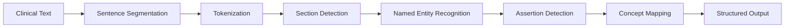

# PyCTAKES


**Python-native clinical NLP framework that mirrors and extends Apache cTAKES**

[](https://badge.fury.io/py/pyctakes)
[](https://pypi.org/project/pyctakes/)
[](https://opensource.org/licenses/Apache-2.0)
[](https://github.com/sonish777/pyctakes/actions)
[](https://pyctakes.readthedocs.io/en/latest/?badge=latest)
[](https://codecov.io/gh/sonish777/pyctakes)

---

## 🏥 What is PyCTAKES?

PyCTAKES is a comprehensive, modern clinical Natural Language Processing framework built entirely in Python. It provides end-to-end clinical text processing capabilities that match and extend Apache cTAKES functionality while being easier to install, use, and extend.

## ✨ Key Features

### 🔬 Complete Clinical NLP Pipeline
- **Sentence Segmentation**: Clinical-aware boundary detection with abbreviation handling
- **Tokenization**: Advanced tokenization with POS tagging and lemmatization
- **Section Detection**: Automatic identification of clinical sections (History, Medications, Assessment, etc.)
- **Named Entity Recognition**: Medical entity extraction (disorders, medications, procedures, anatomy)
- **Negation & Assertion**: pyConText-style negation and assertion detection
- **Concept Mapping**: UMLS integration with CUI normalization

### ⚡ Multiple Pipeline Configurations
- **Default Pipeline**: Full clinical NLP with all features
- **Fast Pipeline**: Speed-optimized with rule-based components
- **Basic Pipeline**: Minimal set for simple use cases
- **Custom Pipeline**: Build your own with configurable annotators

### 🚀 Production Ready
- Pure Python implementation (no Java dependencies)
- Command-line interface and comprehensive Python API
- Extensive error handling and fallback mechanisms
- Comprehensive testing and documentation

## 📦 Quick Start

### Installation

```bash
pip install pyctakes
```

### Basic Usage

```python
import pyctakes

# Create a clinical NLP pipeline
pipeline = pyctakes.create_default_pipeline()

# Process clinical text
clinical_text = """
Patient is a 65-year-old male with diabetes and hypertension.
He presents with chest pain but denies shortness of breath.
Current medications include metformin and lisinopril.
"""

result = pipeline.process_text(clinical_text)

# Access different types of annotations
entities = result.document.get_annotations("NAMED_ENTITY")
for entity in entities:
    print(f"{entity.text} -> {entity.entity_type.value}")
```

**Output:**
```
diabetes -> disorder
hypertension -> disorder  
chest pain -> disorder
shortness of breath -> sign_symptom
metformin -> medication
lisinopril -> medication
```

### Command Line Usage

```bash
# Annotate a clinical note
pyctakes annotate clinical_note.txt --output annotations.json

# Use different pipeline types
pyctakes annotate clinical_note.txt --pipeline fast --format text

# Batch process multiple files
pyctakes batch-process ./clinical_notes/ --output ./annotations/
```

## 🏗️ Architecture

PyCTAKES follows a modular, pipeline-based architecture:



## 📊 Performance

| Pipeline Type | Speed | Features | Use Case |
|---------------|-------|----------|----------|
| **Basic** | ⚡⚡⚡ | Essential NLP | Development, Testing |
| **Fast** | ⚡⚡ | Rule-based | High-throughput Processing |
| **Default** | ⚡ | Complete Clinical NLP | Production, Research |

## 🔧 Configuration

PyCTAKES is highly configurable via JSON configuration files:

```json
{
  "tokenizer": {
    "backend": "spacy",
    "include_pos": true,
    "include_lemma": true
  },
  "ner": {
    "use_model": true,
    "use_rules": true,
    "model_name": "en_core_sci_sm"
  },
  "assertion": {
    "max_scope": 10,
    "custom_cues": [...]
  }
}
```

## 🌟 Use Cases

### Clinical Research
- **Electronic Health Record (EHR) Analysis**: Extract structured data from clinical notes
- **Phenotyping**: Identify patient cohorts based on clinical criteria
- **Clinical Trial Recruitment**: Automated patient screening

### Healthcare Analytics
- **Quality Metrics**: Extract quality indicators from clinical documentation
- **Population Health**: Analyze health trends across patient populations
- **Clinical Decision Support**: Real-time analysis of clinical text

### NLP Research
- **Baseline Framework**: Comprehensive clinical NLP baseline
- **Custom Development**: Extensible platform for clinical NLP research
- **Benchmark Comparisons**: Standardized evaluation framework

## 📚 Documentation

- **[Installation Guide](installation.md)** - Detailed setup instructions
- **[Quick Start Tutorial](quickstart.md)** - Get up and running in minutes
- **[User Guide](user-guide/pipeline.md)** - Comprehensive usage documentation
- **[API Reference](api/pipeline.md)** - Complete API documentation
- **[Examples](examples.md)** - Real-world usage examples

## 🤝 Community & Support

- 📂 **GitHub**: [https://github.com/sonish777/pyctakes](https://github.com/sonish777/pyctakes)
- 📖 **Documentation**: [https://pyctakes.readthedocs.io](https://pyctakes.readthedocs.io)
- 🐛 **Issues**: [GitHub Issues](https://github.com/sonish777/pyctakes/issues)
- 💬 **Discussions**: [GitHub Discussions](https://github.com/sonish777/pyctakes/discussions)

## 🛣️ Roadmap

- **v1.0** ✅ Core clinical NLP pipeline
- **v1.1** 🔄 Relation extraction, Docker support
- **v2.0** 📋 LLM integration, advanced features
- **Future** 🔮 Real-time processing, EHR integration

## 📄 License

PyCTAKES is released under the **Apache-2.0 License**. See [LICENSE](LICENSE) for details.

## 🙏 Acknowledgments

PyCTAKES is inspired by [Apache cTAKES](https://ctakes.apache.org/) and builds upon the excellent work of the clinical NLP community. Special thanks to the developers of spaCy, scispaCy, and other open-source libraries that make this project possible.

---

**Ready to get started?** Check out our [Quick Start Guide](quickstart.md) or explore the [Examples](examples.md)!
